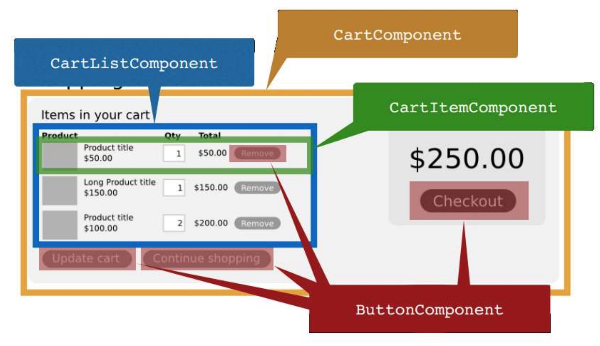
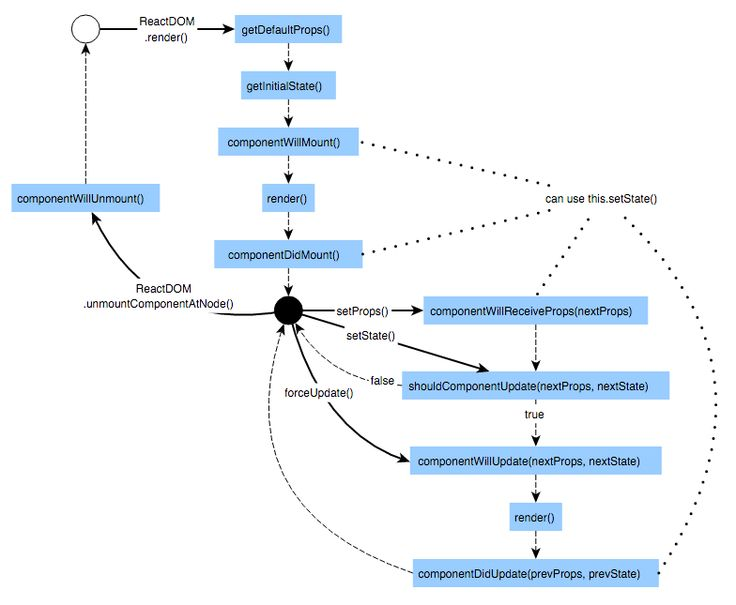
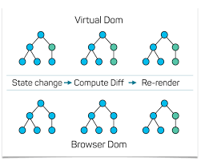
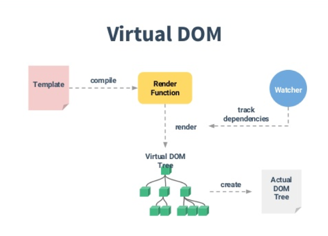
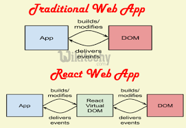

 PDF To Markdown Converter
Debug View
Result View

# Tema 7:

# REact:

### EI1036 EI

### Dolores María Llidó Escrivá

#### Curso 2017 – 2018

---

https://reactjs.org/tutorial/tutorial.html


Most React developers use a special syntax called “JSX” which makes these structures easier to write. The <div /> syntax is transformed at build time to React.createElement('div'). The example above is equivalent to:


https://reactjs.org/tutorial/tutorial.html Juego tic/tac/toe

## Framewoks Plantillas presentaciones

https://alternativeto.net/software/reveal-js/
https://bashooka.com/freebie/tools-frameworks-for-making-pre
sentation-with-html/
slides
remark

*Flowtime.js*
* impress.js

* FormidableLabs/spectacle: ReactJS based Presentation Library: ReactJS based Presentation Library
visual studio directamente convierte a reveal.js.


* Reveal.js is a modern open-source non-linear presentation framework based on HTML5, CSS3 and JavaScript, with cool 3D transition effects, cross-browser support, PDF export, and a WYSIWYG editor.


---

 ReactJS es una librería Javascript desarrollada por Facebook y diseñada para ayudarnos a crear SPA’s (Single Page Application), su objetivo concretamente es tratar de facilitar la tarea de desarrollar interfaces de usuario. 
 Podríamos decir que React es la V en un contexto en el que se use el patrón MVC o MVVM.

-Se creo en 2013 y se liberalizo en 2015.

Hace uso del paradigma denominado  programación orientada a componentes.

-los componentes se representan como clases que heredan de la clase Component cuyo único requerimiento especial es especificar el método render que define cuál será el contenido del mismo:

- sintaxis especial llamada JSX 

 uses the concept called Virtual DOM, creates an in-memory data structure
cache, enumerates the resulting differences, and then updates the browser’s
displayed DOM efficiently.

- Todo en React.js son componentes
- Un componente devuelve un DOM (render)
- Un componente puede dividirse en otros.
- Cada componente se procesa por separado.

---


https://github.com/facebook/react/wiki/Sites-Using-React

React Chrome extension makes debugging  so much easier

---


#Props Propiedades de las componentes
- Los componente aceptan objetos propiedad para crear los elementos del dom.

-Las propiedades de un componente (props) pueden definirse como los atributos de configuración para dicho componente. 
-Las propiedades son los datos de entrada.
- Un componente hijo puede recibir datos a partir de las propiedades del nodo padre.


-Los componentes pueden ser statefull/Stateles

---
# Estados de los omponentes
-Determina el renderizado y comportamiento de los componentes
-Cuando los datos de estado de un componente cambian, el DOM se actualizará al volver a invocar el método render ()


---

REact.js cliente / servidor


 ---

 JSX
 ```
 <MyButton color="blue" shadowSize={2}>
  Click Me
</MyButton>
```
```

React.createElement(
  MyButton,
  {color: 'blue', shadowSize: 2},
  'Click Me'
)```

https://reactjs.org/docs/jsx-in-depth.html


---


### React Portal


HTML

En desarrollo utilizar libreria development.js" y en producción "production.min.js

```HTML
<!-- Load React. -->
<!-- When deploying, replace "development.js" with "production.min.js". -->
<script src="https://unpkg.com/react@16/umd/react.development.js" crossorigin></script>
<script src="https://unpkg.com/react-dom@16/umd/react-dom.development.js" crossorigin></script>

<!-- Load our React component. -->
  <script src="like_button.js"></script>
  ```

Suponemos que tenemos en html
```html
<!-- ... existing HTML ... -->

<div id="like_button_container"></div>

<!-- ... existing HTML ... -->
```

```js like_button.js

const domContainer = document.querySelector('#like_button_container');
ReactDOM.render(e(LikeButton), domContainer);
```


Ejemplo: https://gist.github.com/gaearon/faa67b76a6c47adbab04f739cba7ceda

JSX sample
```JS
const e = React.createElement;

// Display a "Like" <button>
return e(
  'button',
  { onClick: () => this.setState({ liked: true }) },
  'Like'
);
```
---

```
MyWebApp/
  README.md
  node_modules/
  package.json
  public/
    index.html
    favicon.ico
  src/
    App.css
    App.js
    App.test.js
    index.css
    index.js
    logo.svg
```


- node_modules: contiene las dependencias npm del proyecto
- public: esta es la raíz de nuestro servidor donde se podrá encontrar el index.html, el archivo principal y el favicon.
- src: es el directorio principal donde vamos a colocar los archivos de nuestros componentes.


---

Métodos de inicialización:

componentWillMount(): se ejecuta antes de que se renderice el componente por primera vez, es muy util para manejar ciertos datos necesarios para la representación del componente o declarar ciertos eventos. Las referencias a los elementos del componente aun no están disponibles.
componentDidMount(): se dispara justo después del primer renderizado, es decir el DOM ya está disponible. Este es el sitio adecuado para realizar peticiones AJAX, setIntervals o integrar librerías de terceros.
Métodos de actualización:

componentWillReceiveProps(nextProps): es ejecutado cuando las propiedades se van a actualizar, recibe el próximo valor que va a tener el objeto de propiedades.
shouldComponentUpdate(nextProps, nextState): se lanza antes del render y decide si nuestro componente se re-renderiza o no. Recibe dos parametros, las nuevas propiedades y el nuevo estado.
componentWillUpdate(nextProps, nextState): se ejecutará justo después de que shouldComponentUpdate devuelva true, está pensado para preparar al componente para su actualización por lo que se debe evitar modificar estados en este punto.
componentDidUpdate(prevProps, prevState): se invoca justo después de haberse producido la actualización del componente, los cambios ya están trasladados al DOM.
Métodos de desmontaje:

componentWillUnmount(): es el único método que interviene en el desmontaje de un componente, es invocado justo antes de que el componente se desmonte, es ideal para realizar operaciones de limpieza como listeners de eventos o temporizadores.

--



---

Eventos:

La función callback se define en el componente App, handleOnAddUser(event) y será la encargado de manejar el evento.


https://www.slideshare.net/EdurekaIN/reactjs-tutorial-for-beginners-reactjs-redux-training-for-beginners-react-tutorial-edureka

--

```JS
class App extends Component {
  constructor() {
    super();
    this.state = {
      users: [
        {id: 1, name: "miguel", email: "miguelghz@miguelgomez.io"},
        {id: 2, name: "test", email: "test@test.es"}
      ]
    };
  }

  handleOnAddUser (event) {
    event.preventDefault();
    let user = {
      name: event.target.name.value,
      email: event.target.email.value
    };
    this.setState({
      users: this.state.users.concat([user])
    });
  }

  render() {
    return (
        <div>
          <UserList users={this.state.users}  />
          <UserForm onAddUser={this.handleOnAddUser.bind(this)} />
        </div>
    );
  }
}
```

 ---





---
# DOM virtual
- se usa para la re-interpretación eficiente del DOM
- React tiene como objetivo volver a renderizar el árbol virtual solo cuando el estado cambia
- Utiliza 2 árboles virtuales (nuevo y anteriore) para encontrar diferencias y actualización de lotes DOM real
- Observa los cambios de datos (setState) y realiza una comprobación  para saber cuándo volver a procesar el componente.
- Siempre que sea posible, no actualiza todo el componente en DOM real, solo calcula una operación de parche que actualiza parte del DOM

---



Actualiza sólo las diferencias.


--



---



---

JSX:   Stands for JavaScript XML

Podemos incluir js en HTML, poniendlo entre llaves.
<MyComponent foo={1 + 2 + 3 + 4} />

```
function NumberDescriber(props) {
  let description;
  if (props.number % 2 == 0) {
    description = <strong>even</strong>;
  } else {
    description = <i>odd</i>;
  }
  return <div>{props.number} is an {description} number</div>;
}

```
---

https://reactjs.org/community/examples.html
https://snipcart.com/blog/reactjs-wordpress-rest-api-example
```
async componentDidMount() {
  const response = await fetch(`https://api.coinmarketcap.com/v1/ticker/?limit=10`);
  const json = await response.json();
  this.setState({ data: json });
}
```

---

https://www.jamestease.co.uk/blether/use-async-await-with-react-redux
---

https://www.robinwieruch.de/react-fetching-data/

 React’s ecosystem is a flexible framework
  native fetch API 
  It uses JavaScript promises to resolve the asynchronous response. 
React’s ES6 class components have lifecycle methods
render
component
will
did
setstate()
super(props);
Async: 
https://www.robinwieruch.de/react-fetching-data/


---
## 6.6 Optimización CRp

★ Los árboles de CSSOM y DOM se combinan en un árbol de
representación que después se utiliza para calcular el
diseño de cada elemento visible y sirve como información
de entrada para el proceso de pintura que representa los
píxeles en la pantalla.
★ Esto es se llama **ruta de representación crítica: CRP**
★ Optimizar cada uno de esos pasos es fundamental para
lograr un rendimiento de representación óptimo.


## Métodos para medir el rendimiento de CRP.

##### ★ Lighthouse realiza una serie de pruebas automatizadas en una

##### página y genera un informe sobre el rendimiento de CRP en la

##### página.

##### ★ Navigation Timing API captura mediciones de monitoreo de

##### usuario real (RUM). Estas mediciones se capturan de las

##### interacciones que los usuarios reales tienen con tu sitio y

##### proporcionan un panorama preciso del rendimiento de CRP en el

##### mundo real, tal como lo experimentan los usuarios de varios

##### dispositivos y diferentes condiciones de red.


## 6.7 Responsive Web design

Diseño responsive es diseño web que tiene que diseñarse
★ todos los navegadores y sistemas,
★ todas las resoluciones de pantalla
★ todas las velocidades de conexión.


## Responsive Web design

★ **Mejora progresiva** : Estrategia que acentúa la
accesibilidad, que permite que cada uno tenga acceso al
contenido y a la funcionalidad básica de una página web,
usando cualquier navegador web o conexión a Internet,
mientras que también permite a otros con un mayor ancho de
banda o un navegador web más avanzado experimentar una
versión mejorada de la página.
★ **Mobile First:** diseñar primero para móviles y después para
ordenadores de sobremesa.


★ https://stackshare.io/stackups/bootstrap-vs-foundation-vs-
semantic-ui#more
★ https://www.slant.co/topics/3522/~fully-featured-responsiv
e-css-frameworks

```
¿Que framework eliges?¿Por que?
```
## Ejercicio 4: Responsive Frameworks


## 6.8. Buenas Prácticas

★No usar Alert, console.log
★No poner código <script> dentro del body.
★Manejar eventos con addEventHandler.
★No usar innerHtml mejor textContent cuando los datos se obtienen de
formularios. Para evitar XSS(Cross-site scripting) attack
★Activar las x-frame-options en el .htaccess


## Seguiridad en WP

Cualquier software es susceptible de ser hackeado, y los plugins de WordPress no son una excepción, por eso es importante desarrollar el software
teniendo en cuenta los estándares de seguridad en la programación web, y los que nos ofrece el propio CMS, así como mantener un seguimiento del
software para lanzar nuevas versiones en caso de vulnerabilidades.
En este sentido, vimos cómo aplicar varias medidas de seguridad, definidas en ‘capas’ o niveles en dependencia del momento en que el usuario esté
interactuando:

1. **Nivel 1. Javascript desde el navegador:** En este nivel validamos los campos que el usuario debe rellenar, formatos numéricos, etc. La
    validación se hace cuando aún no se ha enviado ningún dato al servidor. Mediante el uso de Javascript en el propio navegador del usuario.
2. **Nivel 2. Funciones PHP:** El propio lenguaje de programación PHP nos proporciona herramientas para comprobar la legitimidad de los datos, con
    funciones como _isset(), empty(), preg_match()_ , etc.
3. **Nivel 3: API de WordPress:** Una vez que tenemos los datos del usuario, podemos llevar a cabo acciones de chequeo de usuarios,
    comprobación de taxonomías, sanitización de cadenas, a través de la familia de funciones _*_exists(), *_validate(), is_*(), sanitize_*(), nonce_*()_ ,
    etc.


This is a offline tool, your data stays locally and is not send to any server!
Feedback & Bug Reports


---

## Typescript/Angular

-  TypeScript es un lenguaje de programación libre y de código abierto desarrollado por Microsoft.
-  Es un **superconjunto de JavaScript** , que esencialmente añade tipado
estático y objetos basados en clases.
-  Los navegadores no convertirán TypeScript a Javascript.
-  Mediante un Transpiler que convierte de código TypeScript a JavaScript.
-  Se puede usar para programar tanto el cliente como el servidor (nodejs).
-  *Angular framework* multiplataforma para aplicaciones web (Angular 5.X )
   -  A diferencia de AngularJs o Angular1.X está programado con TypeScript
   -  Está diseñado para abstraerse del renderizado del DOM,
   -  Se puede utilizar en:Navegadores web, Servidores (Node.js), Web Workers,
Apps móviles nativas (NativeScript, React Native)

```
AngularJS (también denominado Angular 1.x). Es un nuevo framework , escrito desde cero y con conceptos y formas de trabajar completamente distintos.
Angular tiene una curva de aprendizaje bastante empinada para los desarrolladores. Está todo escrito en Typescript
```

---
