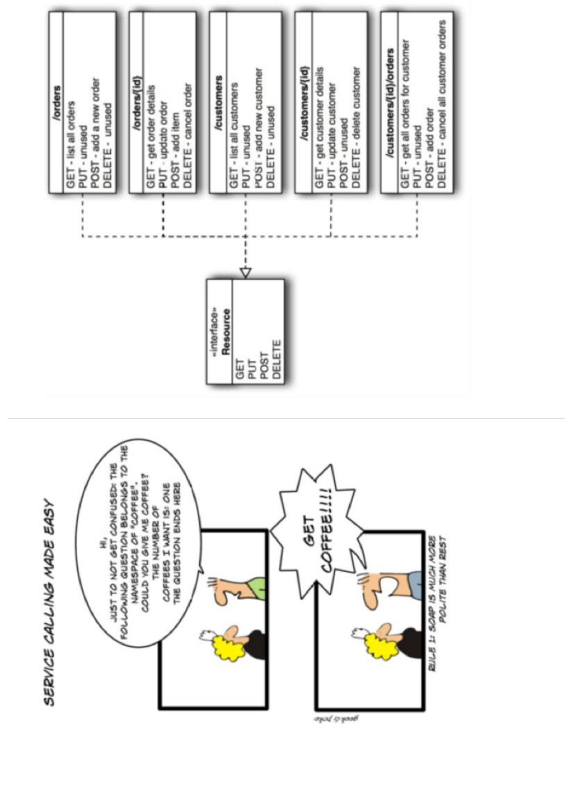

# Tema 7:

##  JavaScript Avanzado

### EI1042 - Tecnologías y Aplicaciones Web

### EI1036 - Tecnologías Web para los Sistemas de Información
# (2019/2020)

 # Professora: Dra. Dolores Mª Llidó Escrivá 
 

[Universitat Jaume I]( https://www.uji.es/ ). 


---

### Índice

1. Servicios Web: Rest
2. Wordpress Rest Api
3. Accesibilidad
4. Normativa Española
5. Seguridad
6. Seguridad en WP
7. Responsive Web design
8. Librerias JS para presentaciones
9. Frameworks en el cliente


---

# 1 Servicio Web


Los Servicios Web son un conjunto de aplicaciones o de tecnologías con capacidad para interoperar en la Web y que intercambian datos entre sí con el objetivo de ofrecer servicios. Los proveedores ofrecen sus servicios como procedimientos remotos y los usuarios solicitan un servicio llamando a estos procedimientos a través de la Web. Estos servicios proporcionan mecanismos de comunicación estándares entre diferentes aplicaciones, que interactúan entre sí para presentar información dinámica al usuario. (http://www.w3c.es/divulgacion/a-z/)


Podemos clasificar los servicios web en:
- Servicios Web **REST**, el propósito principal del servicio es manipular las representación de los recursos WEB (XML,JSON) usando un conjunto uniforme de operaciones sin estado(Métodos).
- Servicios Web **SOAP**: en el cual el servicio se expone con un conjunto arbitrario de operaciones.(XML)

--


## RESt API o servicio web rest

Transferencia de Estado Representacional

Los sistemas REST utilizan estos métodos para identificar operaciones sobre los distintos recursos
- GET (read): Se utiliza para consultar, leer y en definitiva acceder a un recurso
- POST (create): Envía datos para crear un recurso. 
- PUT (update): Utilizado para editar un recurso.
- DELETE (delete): Es la opción para eliminar un recurso


--



(http://geek-and-poke.com/)

---

# 2 Wordpress RestApi


http://v2.wp-api.org/
https://developer.wordpress.org/rest-api/


 Existe un Endpoint especial, llamado wp-json, al que se accede mediante la ruta raíz o inicial y que devuelve toda la información relativa a la API REST
 
 
http://piruletas.cloudaccess.host/wp-json/

Guia de referencia: http://v2.wp-api.org/reference/posts/

http://piruletas.cloudaccess.host//wp-json/wp/v2/posts

http://piruletas.cloudaccess.host//wp-json/wp/v2/posts/2

--

La api Rest de Wordpress permite realizlar  operaciones CRUD pueden afectar a cualquiera de los elementos de información de nuestro sitio WordPress:

- Entradas
- Páginas
- Usuarios
- Multimedia
- Taxonomías

En WordPress 4.7 o posterior, la API REST está activada por defecto. 

--

## Conceptos Wordpress RestApi

- ‘Rutas’ y ‘Puntos finales’(EndPoint):   Las rutas te ayudan a navegar a través de los puntos finales, que son cuando un método HTTP específico  está conectado a una ruta específica. 
- Peticiones (Request). Estas se crean activando los puntos finales correctos y transmitiendo los datos.
- Respuestas (Responses:  proporcionan los datos solicitados o devuelven un error .
- Esquemas (Schema). Estos son los modelos con que se dan las respuestas, así siempre sabrás exactamente dónde buscar los datos correctos.
- Clases de controlador(Controller Classes). En términos simples, te permiten construir tus propias rutas y puntos finales. 

--
## Rutas base 


| Elemento	|  Ruta base |
| ---: | :---: |
|Posts		|  /wp/v2/posts |
| Post Revisions		|  /wp/v2/revisions |
| Categories		|  /wp/v2/categories |
| Tags		|  /wp/v2/tags |
| Pages		|  /wp/v2/pages |
| Comments		|  /wp/v2/comments |
| Taxonomies 	|  	/wp/v2/taxonomies|
|  Media		|  /wp/v2/media |
| Users		|  /wp/v2/users |
| Post Types		|   /wp/v2/types |
| Post Statuses		|   /wp/v2/statuses |
| Settings		|   /wp/v2/settings |


--

curl -X  GET --user username:password -i http://tudominio.com/wp-json/wp/v2/posts?status=draft

--
## Crear nuestras propias funcionalidades REST en WP

Hemos de registrar el servicio en wordpres

https://developer.wordpress.org/reference/functions/register_rest_route/

register_rest_route( string $namespace, string $route, array $args = array(), bool $override = false )


Necesitamos pasar tres cosas para register_rest_route: el espacio de nombres, la ruta que queremos y las opciones. Volveremos al espacio de nombres en un momento, pero por ahora, vamos a elegir myplugin / v1. Vamos a hacer que la ruta coincida con / author / {id}, donde {id} es un número entero.

--


```php 
\\urrl http://example.com/wp-json/myplugin/v1/author/(?P\d+)

add_action( 'rest_api_init', function () {
  register_rest_route( 'myplugin/v1', '/author/(?P<id>\d+)', array(
    'methods' => 'GET',
    'callback' => 'my_awesome_func',
  ) );
} );

<?php
function my_awesome_func( WP_REST_Request $request ) {
  // You can access parameters via direct array access on the object:
  $param = $request['some_param'];
 
  // Or via the helper method:
  $param = $request->get_param( 'some_param' );
 
  // You can get the combined, merged set of parameters:
  $parameters = $request->get_params();
 
  // The individual sets of parameters are also available, if needed:
  $parameters = $request->get_url_params();
  $parameters = $request->get_query_params();
}

```

---


## Guias  accesibilidad

- UAAG 2.0:User Agent Accessibility Guidelines (for developers of
Web browser,)
- WCAG 2.1: Web Content Accessibility Guidelines (site designers)
- ATAG 1.0 : Authoring Tool Accessibility Guidelines (HTML editors)
- WAI-ARIA : Accessible Rich Internet Applications.It especially helps
with dynamic content and advanced user interface controls

--

# Normativas accesibilidad Europea

 Norma UNE 139803:2012 (PDF) , es equivalente a las WCAG 2.0

--

#  Legislación Española

- Ley 34/2002, de 11 de julio, de Servicios de la Sociedad de la Información y de Comercio Electrónico. LSSI
(B.O.E. de 12-7-02). : Se fijaba por primera vez la obligación de que las páginas web de la Administración Pública
española fueran accesibles
Ley 9/2017, de 8 de noviembre, de Contratos del Sector Público, por la que se transponen al ordenamiento jurídico
español las Directivas del Parlamento Europeo y del Consejo 2014/23/UE y 2014/24/UE, de 26 de febrero de 2014.
se incluyen requisitos de _accesibilidad universal y diseño universal o diseño para todas las personas_.

- La publicación de la Directiva (UE) 2016/2102 del Parlamento Europeo y del Consejo, de 26 de octubre de 2016,
sobre la accesibilidad de los sitios web y aplicaciones para dispositivos móviles de los organismos del sector
público, que deberá ser transpuesta a la legislación española antes de septiembre de 2018, y que establece los
requisitos de accesibilidad de los sitios web y apps del sector público.
Esta norma es el estándar europeo que especifica los requisitos funcionales de accesibilidad de los productos y
servicios TIC: los requisitos de accesibilidad de los sitios web (equivalentes al nivel **AA de las WCAG 2.0** ), del
hardware, del software, de los documentos, etc.

--

#### Ejercicio 1

**Leer : [http://www.sidar.org/traducciones/wcag20/es/](http://www.sidar.org/traducciones/wcag20/es/)**

Cita 10 Normas que debería cumplir un portal web.

---

#### Ejercicio 2

[http://www.usableyaccesible.com/archivos/relacion_equivalencia_301](http://www.usableyaccesible.com/archivos/relacion_equivalencia_301)
549_WCAG20.xlsx

Por parejas intentar analizar el portal de la UJI y rellenar la hoja
excel.

SOLUCIÓN:
 -  -  https://docs.google.com/document/d/1V3UgVbwnwxSuBTGteMk2xZhxL3DmoMxz1ojNVLGnLCk/edithttps://docs.google.com/document/d/1d7ovEd79NUav44rrDvxuEqmyk78F4Cxm2F4t8nke9H4/edit

---

# Seguridad

 La seguridad supone un coste económico y de
eficiencia.
- El riesgo cero no es práctico
- Hay diversas formas de mitigar el riesgo
- No se puede gastar un millón para proteger un
céntimo

---

Tipos de seguridad:

1.Seguridad en el Cliente

2.Seguridad en el Servidor

3.Seguridad en la Comunicación

4.Seguridad en la Aplicación

---

## Seguridad en el Cliente:Código móvil

 - Código que circula por la red y se ejecuta en una máquina

remota(cliente)

 - Aparece incrustado en un documento HTML. Un cliente de correo o un navegador que cargue el documento lo ejecutará
en la máquina cliente.

 - Potencia la funcionalidad de los documentos HTML pero entraña riesgos de seguridad. Un código móvil puede obtener
información acerca de un sistema o un usuario y enviarla a una máquina remota.
 - Un método de protección común es tener siempre actualizado el software.

---

## Seguridad en el Servidor

El desarrollo de una aplicación web requiere herramientas:
- servidores web,
- servidores de aplicaciones,
- servidores de bases de datos,
- lenguajes de servidor, etc.
Estas herramientas pueden plantear problemas
- Vulnerabilidades debidas al uso de versiones no actualizadas
- Configuraciones por defecto inadecuadas
- Activación de cuentas por defecto
- Las herramientas deben estar actualizadas y bien configuradas para
impedir ataques a la aplicación.

---

**Seguridad en el Servidor:**

##1.Servidor Web

Precauciones a tener en cuenta:


- Establecer permisos adecuados para los ficheros del
servidor.
- Definir un usuario y grupo especiales (web, www).
- Listado automático de directorios. Puede ser conveniente
pero proporciona información sensible.
- Seguimiento de enlaces simbólicos. Peligroso si se
enlazan ficheros externos al árbol de documentos.

 - Revisar periódicamente los ficheros de log (access_log y

error_log en Apache) para detectar posibles ataques.

 - Configurar los servicios del servidor HTTP necesarios y

deshabilitar los que no se utilizan. (^52)

---

#### 2. Servidor de Bases de Datos

Riesgos:


- Descubrimiento de información acerca de los datos de
conexión al servidor (usuario y clave), información
sensible almacenada en la base de datos (tarjetas de
crédito...) o información sobre la estructura de la base
de datos
- Modificación de las instrucciones SQL enviadas al
servidor, construidas de forma dinámica a partir de
datos recibidos del usuario y por tanto potencialmente
peligrosos ( Inyección SQL )
- Acceso no autorizado a información restringida

---

**Seguridad en el Servidor:**

#### Servidor de Bases de Datos

- Vigilar la configuración por defecto del servidor,(evitar

bases de datos y usuarios predefinidos)

- No ejecutar el servidor BD como root.

- No dar a usuarios de Web acceso a la tabla de usuarios

excepto al administrador.

- Asegurarse el administrador tiene un password seguro

- Restringir el acceso remoto al servidor

- No dar a un usuario más permisos que los estrictamente

necesarios

- Almacenar los datos sensibles de forma encriptada

---

#### 6.3.3 Seguridad en la Comunicación;HTTPS

 - Proteger la información cuando se envía con protocolos seguros
- SSL (Secure Socket Layer) es el primer protocolo para
asegurar el transporte de datos entre el cliente y el servidor
web. Diseñado inicialmente por Netscape, hoy día es soportado
por la mayoría de los servidores web
- Podemos reconocer una conexión HTTP sobre SSL porque
aparece el prefijo ‘HTTPs’ en lugar de ‘HTTP’ en la URL


- Los datos utilizados con HTTPS son seguros vía **TSL**
(Transport Layer Security protocol). Versión actualizada y
más segura del SSL.
- HTTPS permite estas capas de protección:
- encriptación : si algún atacante consigue interceptar esa
información, no le servirá para nada ya que no sabrá
descifrarla (pero tú sí).
- integridad de datos: los atacantes no podrán “modificar” el
contenido del mensaje enviado.
- autenticación : se evitan los ataques de suplantación de
identidad phishing o intermediarios (“ man in the middle ”) en
el que tu usuario proporciona información a terceros cuando
cree que te los está dando a ti.

---


---

#### PHP con HTTPS
```
<?php if

(! isset($_SERVER['HTTPS']) or $_SERVER['HTTPS'] == 'off' )

{ $redirect_url = "https://". $_SERVER['HTTP_HOST'].
$_SERVER['REQUEST_URI']; header("Location: $redirect_url");
exit(); }

?>
```
---


#### Comunicación HTTPS


- Un navegador se intenta conectar con un sitio web protegido con SSL.
- El navegador solicita que el servidor web se identifique.
- El servidor envía una copia de su certificado SSL al navegador.
- El navegador comprueba si confía en el certificado SSL. En caso afirmativo, envía
un mensaje al servidor.
- A su vez, el servidor envía una confirmación firmada digitalmente para iniciar una
sesión SSL cifrada.

**Desventajas** del HTTPS en un sitio web son dos:
 -  Lo costoso del sistema: es necesario usar un servicio de seguridad que se
encarga de verificar y demostrar la autenticidad de cada conexión.
 -  Disminución de la velocidad de carga de las páginas: es necesario acceder a un
tercer sitio antes de cargar el contenido de cualquier página.

---

**Seguridad en el Servidor:**

####  Lenguajes de programación en servidor/cliente

 - Proteger el código fuente para evitar que pueda ser
visualizado, especialmente cuando contiene información
sensible como pueden ser los datos de conexión al servidor
de bases de datos
 - Sacar el código fuente sensible fuera de la raíz de la
web, y protegerlo contra lectura.
 - Validar las instrucciones SQL antes de enviarlas al
servidor.
 - No revelar información sobre la base de datos en los
mensajes de error (esquema, naturaleza de los datos
almacenados, fragmentos SQL).


---

#### 6.4 ClickJacking: robo de clics

 - http://www.elladodelmal.com/2015/08/el-ironframe-para-luchar-contra-ataques.html
 - Cuando el atacante quiere hacer un esquema de ClickJacking, inyecta un
iframe en una web vulnerable y en ese iframe incluye la web de la que
quiere robar los clics a la víctima.
 -  **Solución** proteger nuestros clientes: Evitar la inclusión de una web en
un iframe por medio de HTTP Headers X-Frame-Options.
- **x-frame-options: DENY | SAMEORIGIN**
- Añadir en fichero .htaccess
**Header always append X-Frame-Options SAMEORIGIN**
 - Si esto está activo en la consola dará este error al incluir la página
en otra web.:
Refused to display
'https://www.google.es/maps/@38.9421251,-0.3578288,19z' in a frame
because it set 'X-Frame-Options' to ‘SAMEORIGIN'.

---

#### Robo sesiones

```
session_start();

if (!isset($_SESSION['ACTIVO']))

{ $_SESSION = array();

session_regenerate_id();

setcookie(session_name(), '', time() +3600);

$_SESSION['ACTIVO'] = 1;

$menu="menu_new.phtml";

}

else

{ $menu="menu.phtml";}
```

---

###### 6.5: Seguridad: Top 10

###### https://www.owasp.org

#### The Open Web Application Security Project (OWASP).


- Informe2017 https://www.owasp.org/images/b/b0/OWASP_Top_10_2017_RC2_Final.pdf
- Top 10
- A1-Injection
- A2-Broken Authentication and Session Management
- A3-Cross-Site Scripting (XSS)
- A4-Broken Access Control
- A5-Security Misconfiguration
- A6-Sensitive Data Exposure
- A7-Insufficient Attack Protection
- A8-Cross-Site Request Forgery (CSRF)
- A9-Using Components with Known Vulnerabilities
- A10-Underprotected APIs

---

#### Ejercicio 3

Define y pon un ejemplo de los ataques top 10.

---
## Seguridad en WP

Cualquier software es susceptible de ser hackeado, y los plugins de WordPress no son una excepción, por eso es importante desarrollar el software
teniendo en cuenta los estándares de seguridad en la programación web, y los que nos ofrece el propio CMS, así como mantener un seguimiento del
software para lanzar nuevas versiones en caso de vulnerabilidades.
En este sentido, vimos cómo aplicar varias medidas de seguridad, definidas en ‘capas’ o niveles en dependencia del momento en que el usuario esté
interactuando:

1. **Nivel 1. Javascript desde el navegador:** En este nivel validamos los campos que el usuario debe rellenar, formatos numéricos, etc. La
    validación se hace cuando aún no se ha enviado ningún dato al servidor. Mediante el uso de Javascript en el propio navegador del usuario.
2. **Nivel 2. Funciones PHP:** El propio lenguaje de programación PHP nos proporciona herramientas para comprobar la legitimidad de los datos, con
    funciones como _isset(), empty(), preg_match()_ , etc.
3. **Nivel 3: API de WordPress:** Una vez que tenemos los datos del usuario, podemos llevar a cabo acciones de chequeo de usuarios,
    comprobación de taxonomías, sanitización de cadenas, a través de la familia de funciones _*_exists(), *_validate(), is_*(), sanitize_*(), nonce_*()_ ,
    etc.


This is a offline tool, your data stays locally and is not send to any server!
Feedback & Bug Reports

---


## Recomendación en WP manejo sessiones:

- Se aconseja no usar el objeto SESSION de php.
- Se recomienda completar todas las opciones disponibles para la acción que desea realizar con HTML o PHP. 
- Luego, con JavaScript  seleccionar qué opción cargar (según la presencia de la cookie). De esta forma, la página completa servida por el caché aún se ajustará a todos los escenarios, ya que el JavaScript del lado del navegador determinará cuál de las opciones disponibles se muestra. 


---
 admin_ajax.calll
 https://gist.github.com/octalmage/2df40777a983b9ba92c6fd351ee615b3

```html
if (readCookie('preferredMember') === 'true') {
  $('#sidebar1').show();
} else {
  $('#sidebar2').show();
}

$('#setMemberButton').on('click', function() {
  createCookie('preferredMember', 'true');
});

$('#deleteMemberButton').on('click', function() {
  eraseCookie('preferredMember');
});

function createCookie(name, value, days) {
  var expires = "";
  if (days) {
    var date = new Date();
    date.setTime(date.getTime() + (days * 24 * 60 * 60 * 1000));
    expires = "; expires=" + date.toUTCString();
  }
  document.cookie = name + "=" + value + expires + "; path=/";
}

function readCookie(name) {
  var nameEQ = name + "=";
  var ca = document.cookie.split(';');
  for (var i = 0; i < ca.length; i++) {
    var c = ca[i];
    while (c.charAt(0) == ' ') c = c.substring(1, c.length);
    if (c.indexOf(nameEQ) == 0) return c.substring(nameEQ.length, c.length);
  }
  return null;
}

function eraseCookie(name) {
  createCookie(name, "", -1);
}
```

```html
Edit in JSFiddle
JavaScript
HTML
Result
<div id="sidebar1" class="hide">
  Welcome preferred member!
  
</div>
<div id="sidebar2" class="hide">
  Welcome, please consider signing up!
  
</div>

<button id="setMemberButton">
  Add Cookie
</button>
<button id="deleteMemberButton">
  Delete Cookie
</button>
```
---

Recomendación en WP manejo sessiones:

Aún así si se requiere utilizar cookies desde php se tienen 2 opciones:

- Configurando el servidor para que no utilice cache.
- Utilizar admin-ajax calls :Esto desencadena una solicitud POST a admin-ajax.php que recibe  php para realizar distintas acciones.

---

#### Evolución

---

**

## Librerias JS para presentaciones

- * Flowtime.js *
- * impress.js
- * FormidableLabs/spectacle: utiliza ReactJS 
- * Reveal.js  


---
## Typescript

-  TypeScript es un lenguaje de programación libre y de código abierto desarrollado por Microsoft.
-  Es un **superconjunto de JavaScript** , que esencialmente añade tipado
estático y objetos basados en clases.
-  Los navegadores no convertirán TypeScript a Javascript.
-  Mediante un Transpiler que convierte de código TypeScript a JavaScript.
-  Se puede usar para programar tanto el cliente como el servidor (nodejs).

---

Frameworks en el cliente Web

-  Angular  (TypeScript).
-  ReactJS es una librería Javascript desarrollada por Facebook.
-  Vue:  Esta en una fase inicial, parecido al angular. Es una libreria pequeña  20KB.
  


---

Comparativa: 
  
https://medium.com/@TechMagic/reactjs-vs-angular5-vs-vue-js-what-to-choose-in-2018-b91e028fa91d


---

#  ReactJS 


- Librería Javascript desarrollada por Facebook y diseñada para ayudarnos a crear SPA’s (Single Page Application), su objetivo concretamente es tratar de facilitar la tarea de desarrollar interfaces de usuario.

- Podríamos decir que React es la V en un contexto en el que se use el patrón MVC o MVVM.

- Se creo en 2013 y se liberalizo en 2015.

- Hace uso del paradigma denominado  programación orientada a componentes.
- Utiliza una sintaxis especial llamada JSX 

---


https://github.com/facebook/react/wiki/Sites-Using-React

React Chrome extension makes debugging  so much easier


---

# Virtual DOM

React crea lo que se denomina Virtual DOM una estructura de datos en memoria donde se almacenan las diferencias entre lo que hay en el navegador y los que queremos que aparezca.

Por tanto react enumera las diferencias entre el DOM inicial y el final para renderizar el DOM más eficientemente.

 

---
# DOM virtual
- se usa para la re-interpretación eficiente del DOM
- React tiene como objetivo volver a renderizar el árbol virtual solo cuando el estado cambia
- Utiliza 2 árboles virtuales (nuevo y anteriore) para encontrar diferencias y actualización de lotes DOM real
- Observa los cambios de datos (setState) y realiza una comprobación  para saber cuándo volver a procesar el componente.
- Siempre que sea posible, no actualiza todo el componente en DOM real, solo calcula una operación de parche que actualiza parte del DOM

---


Actualiza sólo las diferencias.


--


---


---


# Componentes ReactJS 


Los componentes se representan como clases que heredan de la clase Component cuyo único requerimiento especial es especificar el método render que define cuál será el contenido del mismo:


- Todo en React.js son componentes
- Un componente devuelve un DOM (render)
- Un componente puede dividirse en otros.
- Cada componente se procesa por separado.
  

---

## Props Propiedades de las componentes
- Los componente aceptan objetos propiedad para crear los elementos del dom.

-Las propiedades de un componente (props) pueden definirse como los atributos de configuración para dicho componente. 
-Las propiedades son los datos de entrada.
- Un componente hijo puede recibir datos a partir de las propiedades del nodo padre.


-Los componentes pueden ser statefull/Stateles

---
## Estados de los componentes

-Determina el renderizado y comportamiento de los componentes
-Cuando los datos de estado de un componente cambian, el DOM se actualizará al volver a invocar el método render ()


---

REact.js cliente / servidor


 ---

 JSX
 ```
 <MyButton color="blue" shadowSize={2}>
  Click Me
</MyButton>
```

```

React.createElement(
  MyButton,
  {color: 'blue', shadowSize: 2},
  'Click Me'
)```

https://reactjs.org/docs/jsx-in-depth.html


---


JSX Sintaxis


https://reactjs.org/tutorial/tutorial.html

 The <div /> is transformed at build time to React.createElement('div'). The example above is equivalent to:


https://reactjs.org/tutorial/tutorial.html Juego tic/tac/toe

---


### React Portal


HTML

En desarrollo utilizar libreria development.js" y en producción "production.min.js

```HTML
<!-- Load React. -->
<!-- When deploying, replace "development.js" with "production.min.js". -->
<script src="https://unpkg.com/react@16/umd/react.development.js" crossorigin></script>
<script src="https://unpkg.com/react-dom@16/umd/react-dom.development.js" crossorigin></script>

<!-- Load our React component. -->
  <script src="like_button.js"></script>
  ```

Suponemos que tenemos en html
```html
<!-- ... existing HTML ... -->

<div id="like_button_container"></div>

<!-- ... existing HTML ... -->
```

``` js 
//like_button.js
const domContainer = document.querySelector('#like_button_container');
ReactDOM.render(e(LikeButton), domContainer);
```

---

Ejemplo: https://gist.github.com/gaearon/faa67b76a6c47adbab04f739cba7ceda

JSX sample
```JS
const e = React.createElement;

// Display a "Like" <button>
return e(
  'button',
  { onClick: () => this.setState({ liked: true }) },
  'Like'
);
```

---


Métodos de inicialización:

- componentWillMount(): se ejecuta antes de que se renderice el componente por primera vez, es muy util para manejar ciertos datos necesarios para la representación del componente o declarar ciertos eventos. Las referencias a los elementos del componente aun no están disponibles.
- componentDidMount(): se dispara justo después del primer renderizado, es decir el DOM ya está disponible. Este es el sitio adecuado para realizar peticiones AJAX, setIntervals o integrar librerías de terceros.
Métodos de actualización:

- componentWillReceiveProps(nextProps): es ejecutado cuando las propiedades se van a actualizar, recibe el próximo valor que va a tener el objeto de propiedades.
shouldComponentUpdate(nextProps, nextState): se lanza antes del render y decide si nuestro componente se re-renderiza o no. Recibe dos parametros, las nuevas propiedades y el nuevo estado.
- componentWillUpdate(nextProps, nextState): se ejecutará justo después de que shouldComponentUpdate devuelva true, está pensado para preparar al componente para su actualización por lo que se debe evitar modificar estados en este punto.
componentDidUpdate(prevProps, prevState): se invoca justo después de haberse producido la actualización del componente, los cambios ya están trasladados al DOM.
Métodos de desmontaje:

- componentWillUnmount(): es el único método que interviene en el desmontaje de un componente, es invocado justo antes de que el componente se desmonte, es ideal para realizar operaciones de limpieza como listeners de eventos o temporizadores.

--


---

Eventos:

La función callback se define en el componente App, handleOnAddUser(event) y será la encargado de manejar el evento.


https://www.slideshare.net/EdurekaIN/reactjs-tutorial-for-beginners-reactjs-redux-training-for-beginners-react-tutorial-edureka


https://www.ibenic.com/react-render-content-wp-rest-api/


--

```JS
class App extends Component {
  constructor() {
    super();
    this.state = {
      users: [
        {id: 1, name: "miguel", email: "miguelghz@miguelgomez.io"},
        {id: 2, name: "test", email: "test@test.es"}
      ]
    };
  }

  handleOnAddUser (event) {
    event.preventDefault();
    let user = {
      name: event.target.name.value,
      email: event.target.email.value
    };
    this.setState({
      users: this.state.users.concat([user])
    });
  }

  render() {
    return (
        <div>
          <UserList users={this.state.users}  />
          <UserForm onAddUser={this.handleOnAddUser.bind(this)} />
        </div>
    );
  }
}
```

---


---

JSX:   Stands for JavaScript XML

Podemos incluir js en HTML, poniendlo entre llaves.
<MyComponent foo={1 + 2 + 3 + 4} />

```
function NumberDescriber(props) {
  let description;
  if (props.number % 2 == 0) {
    description = <strong>even</strong>;
  } else {
    description = <i>odd</i>;
  }
  return <div>{props.number} is an {description} number</div>;
}

```
---

React Developer Tools : Añadirlo a navegador para depurar.

https://reactjs.org/community/examples.html
https://snipcart.com/blog/reactjs-wordpress-rest-api-example
```
async componentDidMount() {
  const response = await fetch(`https://api.coinmarketcap.com/v1/ticker/?limit=10`);
  const json = await response.json();
  this.setState({ data: json });
}
```

---

https://www.jamestease.co.uk/blether/use-async-await-with-react-redux

---

https://www.robinwieruch.de/react-fetching-data/

 React’s ecosystem is a flexible framework
  native fetch API 
  It uses JavaScript promises to resolve the asynchronous response. 
React’s ES6 class components have lifecycle methods
render
component
will
did
setstate()
super(props);
Async: 
https://www.robinwieruch.de/react-fetching-data/


---

## 6.6 Optimización CRP

★ Los árboles de CSSOM y DOM se combinan en un árbol de
representación que después se utiliza para calcular el
diseño de cada elemento visible y sirve como información
de entrada para el proceso de pintura que representa los
píxeles en la pantalla.
★ Esto es se llama **ruta de representación crítica: CRP**
★ Optimizar cada uno de esos pasos es fundamental para
lograr un rendimiento de representación óptimo.


## Métodos para medir el rendimiento de CRP.

- ***Lighthouse*** realiza una serie de pruebas automatizadas en una página y genera un informe sobre el rendimiento de CRP en la página.
- ***Navigation Timing API*** captura mediciones de monitoreo de usuario real (RUM). Estas mediciones se capturan de las interacciones que los usuarios reales tienen con tu sitio y
proporcionan un panorama preciso del rendimiento de CRP en el
 mundo real, tal como lo experimentan los usuarios de varios
dispositivos y diferentes condiciones de red.

## 6.7 Responsive Web design

Diseño responsive es diseño web que tiene que diseñarse
★ todos los navegadores y sistemas,
★ todas las resoluciones de pantalla
★ todas las velocidades de conexión.


## Responsive Web design

★ **Mejora progresiva** : Estrategia que acentúa la
accesibilidad, que permite que cada uno tenga acceso al
contenido y a la funcionalidad básica de una página web,
usando cualquier navegador web o conexión a Internet,
mientras que también permite a otros con un mayor ancho de
banda o un navegador web más avanzado experimentar una
versión mejorada de la página.
★ **Mobile First:** diseñar primero para móviles y después para
ordenadores de sobremesa.


★ https://stackshare.io/stackups/bootstrap-vs-foundation-vs-
semantic-ui#more
★ https://www.slant.co/topics/3522/~fully-featured-responsiv
e-css-frameworks

```
¿Que framework eliges?¿Por que?
```
## Ejercicio 4: Responsive Frameworks


## 6.8. Buenas Prácticas

★No usar Alert, console.log
★No poner código <script> dentro del body.
★Manejar eventos con addEventHandler.
★No usar innerHtml mejor textContent cuando los datos se obtienen de
formularios. 
Para evitar XSS(Cross-site scripting) attack Activar las x-frame-options en el .htaccess
